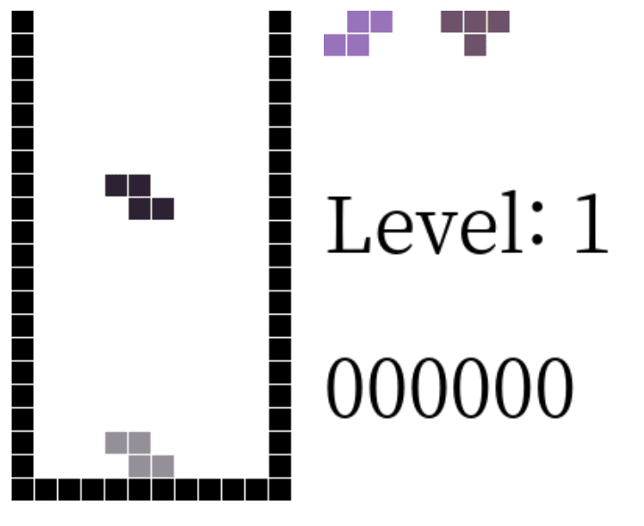

[솔로 플레이 링크](http://tetris.dicemono.xyz/)
## 조작 키
* 시계 회전 : s
* 반시계 회전 : a
* 이동 : 방향키
* 블럭 낙하 : space

## Refactoring By MVC Pattern

## Model
1. Block
2. GameBoard
3. CurrentBlock
4. NextBlock
5. Score

## View
1. GameBoardViewer
2. CurrentBlockViewer
3. NextBlockViewer
4. ScoreViewer

## Controller
1. KeyHandler
2. isConflict
3. StackBlockHandler
4. Scheduler
5. ScoreHandler

## Feature
* rotate block
* stack block
* clear full line
* show next block
* schedule process 

add change merge fix update improve

## Scoring
* first level is one
* if player clears 10 lines, level up.
* line-clear-score = level * ((3 ^ (lines)) * 10)
* drop-score = level * (distance)

